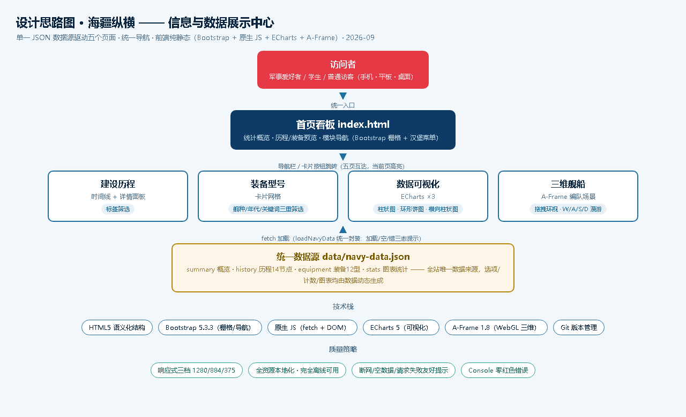

# 需求分析

**作品名称**：海疆纵横 · 中国海军建设历程与代表性装备信息与数据展示中心

## 一、解决什么问题

中国海军 1949 年建军至今 70 余年的发展脉络、代表性装备型号及其技战术参数，散落在各类新闻报道与百科条目中，缺乏一个**统一入口、统一数据、可视化呈现**的聚合视图。本作品把这些公开资料整理为一份结构化 JSON 数据源，并以看板式静态站点呈现，让访问者能够：

1. 按**时间线**纵览建设历程中的 14 个重大节点；
2. 按**舰种 / 年代 / 关键词**三重筛选检索 12 型代表性装备；
3. 通过**图表**直观理解年代分布、舰种构成与排水量对比；
4. 在**三维场景**中环视航母、驱逐舰、核潜艇等舰船模型的体量与布局。

## 二、服务对象

| 对象 | 使用场景 |
|---|---|
| 军事爱好者 | 快速检索装备型号、查阅历程节点详情 |
| 学生 / 学习者 | 期末作业展示、数据可视化与前端技术学习参考 |
| 普通访客 | 无门槛浏览，无需注册登录，手机 / 桌面均可访问 |

## 三、功能模块

1. **首页看板**（index.html）：统计概览（成立年份 / 装备数 / 节点数 / 舰种数）、历程节点速览、精选装备卡片、模块导航；
2. **建设历程**（history.html）：时间线 + 类别标签筛选（全部/奠基/建制/装备/核力量/远海/航母/两栖）+ 点击节点显示详情面板；
3. **装备型号**（equipment.html）：卡片网格 + 舰种/年代/关键词三重筛选 + 重置 + 计数，含加载/空/错三态；
4. **数据可视化**（stats.html）：ECharts 三图——各年代入列装备数量柱状图、舰种数量构成环形饼图、各舰种最大排水量横向柱状图；
5. **三维舰船**（three-d/showcase.html）：A-Frame 海上编队场景，含航母/驱逐舰/核潜艇/两栖攻击舰/补给舰模型，支持环视与漫游。

非功能需求：全站资源本地化（Bootstrap/ECharts/A-Frame 均存于 lib/，无 CDN 外链），**完全离线可用**；响应式适配宽屏 1280 / 中屏 884 / 手机 375 三档宽度；网络断开、数据为空、请求失败均有友好提示。

## 四、设计思路图

设计思路：以 `data/navy-data.json` 为单一数据源，五个页面共享统一导航，首页作为聚合入口串联其余四个功能模块。

（图示：用户 → 首页看板 → 四大功能模块 → 统一 JSON 数据源；右侧标注技术栈与质量策略）

## 五、技术选型约束

- 不要求后端，不使用 React/Vue 等未讲授框架；
- 必含 jQuery 或 Bootstrap 至少一种 → **Bootstrap 5.3.3**（栅格 + 导航栏 + 折叠菜单）；
- 必含 Three.js 或 A-Frame 至少一种 → **A-Frame 1.8.0**（声明式 HTML 标签建模，学习成本低，天然支持漫游控制）；
- 图表库 → **ECharts 5.x**（详见 [charts.md](charts.md) 选型说明）。
